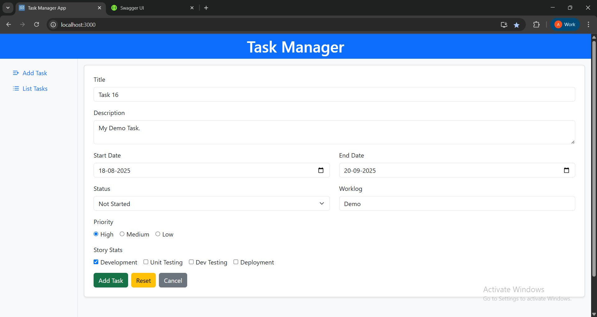

# Task_Manager_App

## Overview

**Task_Manager_App** is a full-stack, interactive task management application featuring a **React frontend** and a **.NET 8 Web API backend**, using **MS SQL Server** for persistent data storage. The app supports complete **CRUD operations** (Create, Read, Update, Delete) on tasks. The entire application is **Dockerized** for seamless setup and deployment. Tasks can also be **sorted and filtered by status**, making it easy to track progress across multiple tasks. Users can add, edit, reset, and delete tasks through a responsive, modern UI with real-time form validation and instant feedback via toast notifications.

## Features

- **Add Task**: Create tasks with title, description, start/end dates, status, priority, and worklog.
- **Update Task**: Update existing tasks seamlessly.
- **Reset Task Form**: Clear form fields quickly to start fresh.
- **Delete Task**: Remove tasks with a confirmation modal to prevent accidental deletions.
- **Task List View**: Display tasks in an organized, paginated table.
- **Filter & Sort by Status**: View tasks filtered by their current status (Not Started, In Progress, Completed) to manage your workflow easily.
- **Toast Notifications**: Get immediate feedback for actions like add, update, and delete.
- **Form Validation**: Real-time validation with asterisks for required or invalid fields.
- **Backend API**: Built with **.NET 8 Web API** for scalable task management.
- **SQL Database**: Uses **Microsoft SQL Server** to store and manage task data.
- **Dockerized Application**: Both frontend and backend are containerized using Docker and orchestrated with Docker Compose.
- **Responsive UI**: Includes a collapsible side menu, colored status indicators, and a user-friendly layout.

## Technologies Used

- **Frontend**:
  - React
  - JavaScript (or TypeScript if extended later)
  - HTML & CSS
- **Backend**:
  - .NET 8 Web API
  - Entity Framework Core
  - MS SQL Server
- **Others**:
  - Axios (frontend API communication)
  - React Toastify (notifications)
  - FontAwesome (icons)
  - Docker & Docker Compose (containerization)


## Project Architecture

```plaintext
Task_Manager_App/
├── Task_Manager_Frontend/   # React frontend
├── Task_Manager_Backend/    # .NET Web API backend
└── docker-compose.yaml      # Orchestrates frontend & backend services```

```
##  Setup & Run

1. **Clone the repository**  
   ```bash
   git clone <your-github-repo-url>
   cd Task_Manager_App

2. **Start with Docker Compose**  
   ```bash
   docker compose up --build

3. **Access the application**
   - Frontend: http://localhost:3000
   - Backend Swagger UI: http://localhost:5000/swagger/index.html

4. **Use the App**
 - Add, edit, delete, and filter tasks directly from the frontend.
 - All task data is saved and retrieved via your .NET backend and stored in your SQL database.

## Notes
- The API base URL is set in the frontend’s .env file using REACT_APP_API_BASE_URL.
- Swagger UI (backend) provides a convenient way to test and explore the API endpoints.
- Tasks can be filtered by status in the frontend for better task management.
- Ensure Docker Desktop is installed and running before starting the app.

## Screenshots

### Home Screens

#### List Tasks Page
  

#### Add Task Page
  

---

### Add Task

  

---

###  Update Task

  

---

### Delete Task

#### Delete Confirmation Modal
  

#### Task Deleted
  

---

### Task Lists

#### Task List View 1
  

#### Task List View 2
  

---

### Task Sorting & Status Filters

#### Not Started Tasks
  

#### In Progress Tasks
  

#### Completed Tasks
  

---

### Backend & Deployment

#### Backend SQL Data
  

#### Swagger API
  

#### Docker Setup
 

---

## License

```bash
This project is licensed for personal and educational use.
Developed by Akshay Chandarkar.

